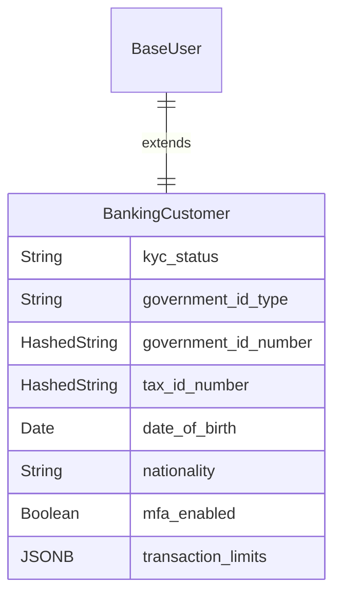
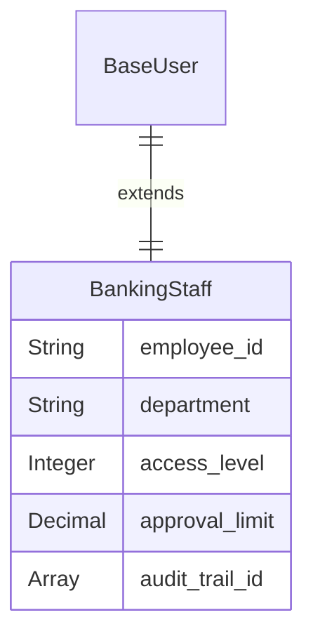
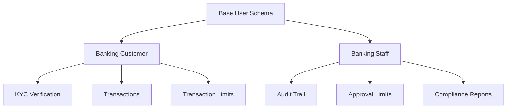

# Fintech/Banking User Schemas

User schemas in banking are heavily focused on identity verification, security, and regulatory compliance (KYC/AML).

## Banking Customer/Client

This is the most rigorous schema, designed for trust, security, and legal adherence.

| Field Name | Data Type | Description |
|------------|-----------|-------------|
| ... (Base Schema) | - | All foundational user fields. |
| `kyc_status` | String (Enum) | **Crucial Field.** Status of identity verification: not_started, pending, verified, rejected. |
| `government_id_type` | String (Enum) | Type of ID provided: passport, drivers_license, national_id. |
| `government_id_number` | HashedString | The user's hashed ID number. Stored securely. |
| `tax_id_number` | HashedString | The user's Tax Identification Number (e.g., SSN, NPWP). |
| `date_of_birth` | Date | Required for identity verification and compliance. |
| `nationality` | String | User's nationality, for regulatory reporting. |
| `mfa_enabled` | Boolean | true if Multi-Factor Authentication is active for the account. |
| `transaction_limits` | JSONB | Daily/monthly limits for transfers, withdrawals, etc. |

## Banking Admin/Staff

This schema emphasizes authorization levels and strict audit trails for accountability.

| Field Name | Data Type | Description |
|------------|-----------|-------------|
| ... (Base Schema) | - | All foundational user fields. |
| `employee_id` | String | Unique internal ID for the bank employee. |
| `department` | String (Enum) | compliance, customer_relations, loan_officer, teller, fraud_analyst. |
| `access_level` | Integer | A numerical level (e.g., 1-5) dictating access to sensitive data. |
| `approval_limit` | Decimal | The maximum transaction amount this user can approve without escalation. |
| `audit_trail_id` | Array (Relation) | A strict, immutable log of all actions taken by the staff member. |

## Banking Schema Relationships

## Compliance Requirements

### KYC (Know Your Customer)
- **Document Verification**: Government-issued ID, proof of address, proof of income
- **Risk Assessment**: Customer risk scoring based on various factors
- **Ongoing Monitoring**: Regular review of customer activity and risk profile

### AML (Anti-Money Laundering)
- **Transaction Monitoring**: Automated detection of suspicious patterns
- **Reporting**: Mandatory reporting of suspicious transactions
- **Record Keeping**: 5-7 year retention of customer records

### Data Protection
- **Encryption**: All sensitive data must be encrypted at rest and in transit
- **Access Controls**: Role-based access with principle of least privilege
- **Audit Logging**: Complete audit trail of all data access and modifications

## Implementation Notes

- **KYC Status Workflow**: Implement state machine for KYC verification process
- **Document Storage**: Use secure document storage service with encryption
- **Transaction Limits**: Store as JSONB: `{"daily": 10000, "monthly": 50000, "currency": "USD"}`
- **Audit Trail**: Use immutable logging with blockchain-like integrity
- **MFA Implementation**: Support multiple MFA methods (SMS, authenticator apps, hardware tokens) 