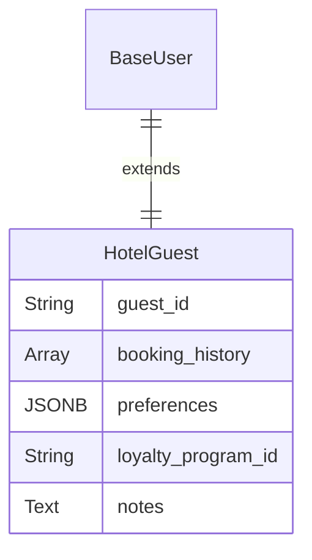
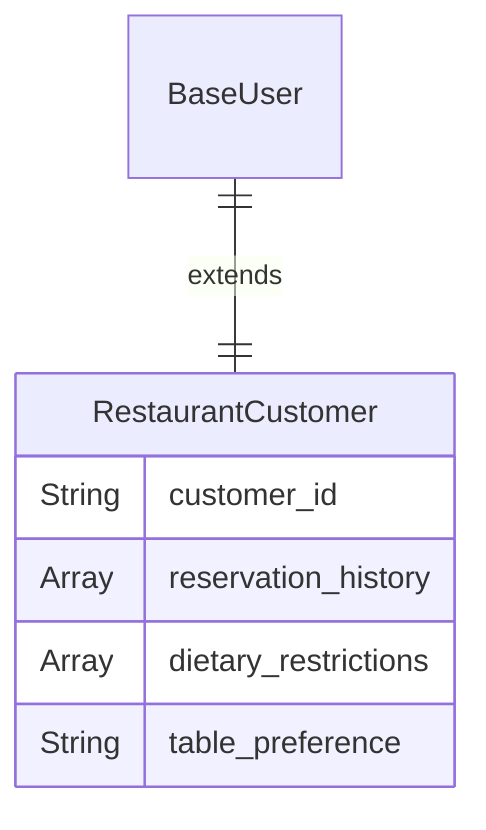
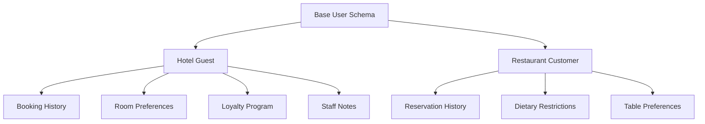

# Hospitality User Schemas

Hospitality schemas are about managing the guest experience, from booking to service delivery and personalization.

## Hotel Guest

The schema manages reservations and tailors the stay to guest preferences.

| Field Name | Data Type | Description |
|------------|-----------|-------------|
| ... (Base Schema) | - | All foundational user fields. |
| `guest_id` | String | A unique guest profile ID for tracking stay history. |
| `booking_history` | Array (Relation) | A list of all past and upcoming reservation IDs. |
| `preferences` | JSONB | Stores preferences like {"room": "high_floor", "bed": "king"}. |
| `loyalty_program_id` | String | The guest's membership number in the hotel's loyalty program. |
| `notes` | Text | Internal notes for staff regarding the guest (e.g., "VIP"). |

## Restaurant Customer

Simpler than a hotel guest, this schema focuses on reservations and dining preferences.

| Field Name | Data Type | Description |
|------------|-----------|-------------|
| ... (Base Schema) | - | All foundational user fields. |
| `customer_id` | String | A unique ID for the dining customer. |
| `reservation_history` | Array (Relation) | A list of past and upcoming table reservation IDs. |
| `dietary_restrictions` | Array | Stores allergies or needs like ["gluten-free", "nut_allergy"]. |
| `table_preference` | String | Records a customer's preferred seating (e.g., "booth", "patio"). |

## Hospitality Schema Relationships

## Guest Experience Management

### Hotel Guest Services
- **Personalization**: Room preferences, pillow types, amenities
- **Loyalty Programs**: Points accumulation, tier benefits, special offers
- **Concierge Services**: Special requests, local recommendations
- **Communication**: Pre-arrival, during stay, and post-stay messaging

### Restaurant Customer Services
- **Reservation Management**: Table preferences, special occasions
- **Dietary Accommodations**: Allergies, restrictions, preferences
- **Service Preferences**: Preferred servers, timing preferences
- **Feedback Collection**: Post-dining surveys and ratings

## Implementation Notes

- **Guest ID Format**: Use format like `GUEST-{hotel_code}-{sequence}` for hotel guests
- **Customer ID Format**: Use format like `DINE-{restaurant_code}-{sequence}` for restaurant customers
- **Preferences Storage**: Store as JSONB: `{"room": {"floor": "high", "bed": "king", "view": "ocean"}, "amenities": ["extra_pillows", "minibar"]}`
- **Booking History**: Link to separate reservations table with stay details
- **Loyalty Integration**: Connect to external loyalty program APIs
- **Staff Notes**: Implement role-based access for sensitive guest information
- **Dietary Restrictions**: Store as array: `["gluten-free", "dairy-free", "nut_allergy"]`
- **Table Preferences**: Store as string: `"booth", "patio", "window", "quiet_corner"` 