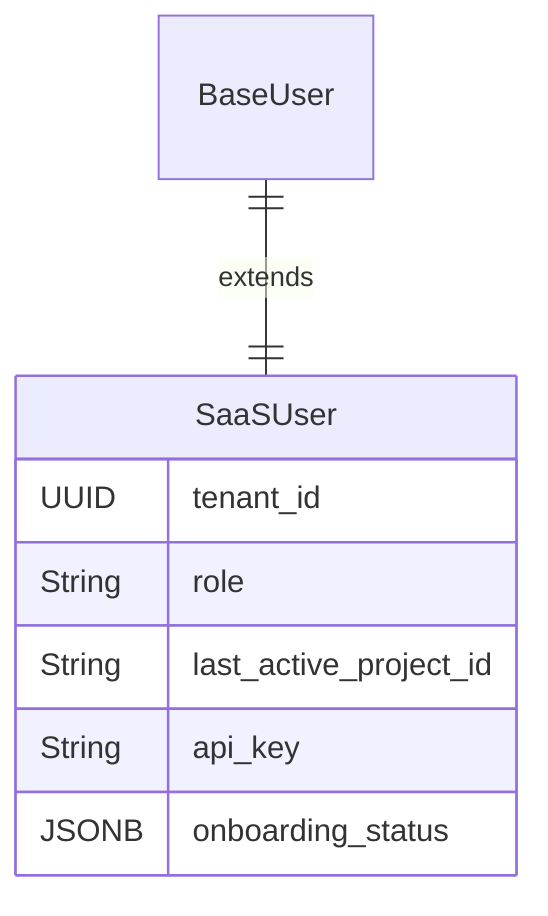
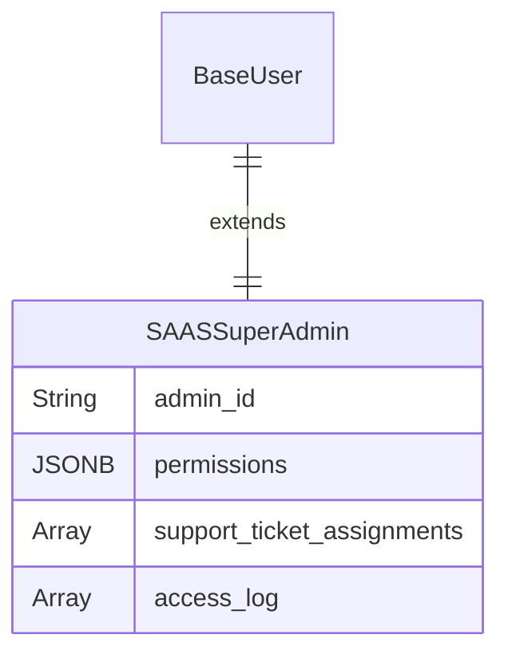
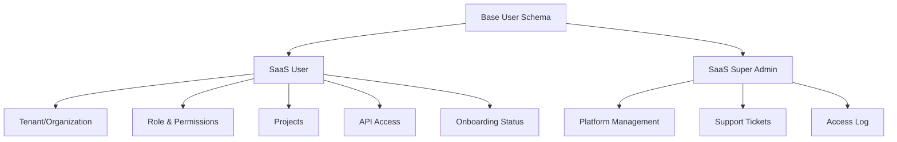

# SaaS User Schemas

SaaS user schemas are often designed for a B2B context, focusing on multi-user accounts (tenants) and role-based feature access.

## SaaS User (within a Tenant)

The schema defines a user's place within a team and their specific permissions.

| Field Name | Data Type | Description |
|------------|-----------|-------------|
| ... (Base Schema) | - | All foundational user fields. |
| `tenant_id` | UUID (Relation) | **Key Field.** The ID of the company/organization account this user belongs to. |
| `role` | String (Enum) | Role within the tenant: owner, admin, editor, viewer, billing_manager. |
| `last_active_project_id` | String (Relation) | A UX feature to take the user back to their last point of work. |
| `api_key` | String | A personal API key for programmatic access to the service. |
| `onboarding_status` | JSONB | Tracks the steps a user has completed in the initial onboarding flow. |

## SaaS Super Admin

This is the platform owner's schema for managing the entire service and all tenants.

| Field Name | Data Type | Description |
|------------|-----------|-------------|
| ... (Base Schema) | - | All foundational user fields. |
| `admin_id` | String | A unique identifier for the platform administrator. |
| `permissions` | JSONB | Defines god-mode capabilities: can_impersonate_users, can_manage_subscriptions, can_view_all_tenants. |
| `support_ticket_assignments` | Array (Relation) | A link to support tickets assigned to this admin. |
| `access_log` | Array (Relation) | A detailed log of all tenants and data this admin has accessed. |

## SaaS Schema Relationships

## Multi-Tenant Architecture

### Tenant Management
- **Organization Isolation**: Complete data separation between tenants
- **Shared Resources**: Efficient resource utilization across tenants
- **Customization**: Tenant-specific configurations and branding
- **Billing**: Per-tenant subscription management and usage tracking

### User Roles & Permissions
- **Role-Based Access Control (RBAC)**: Predefined roles with specific permissions
- **Granular Permissions**: Fine-grained control over features and data access
- **Inheritance**: Role permissions can be overridden at the user level
- **Audit Trail**: Complete logging of permission changes and access

## Implementation Notes

- **Tenant ID**: Use UUID for tenant identification to ensure uniqueness
- **Role Hierarchy**: Implement as enum: `owner`, `admin`, `editor`, `viewer`, `billing_manager`
- **Onboarding Status**: Store as JSONB: `{"welcome_completed": true, "project_created": false, "team_invited": true}`
- **API Key Management**: Generate secure API keys with proper scoping and rotation
- **Permission Storage**: Store as JSONB: `{"can_manage_users": true, "can_view_billing": false, "can_export_data": true}`
- **Last Active Project**: Store project ID for UX continuity across sessions
- **Support Ticket Assignment**: Link to external support system or internal ticketing
- **Access Logging**: Implement comprehensive audit trail for compliance and security
- **Tenant Isolation**: Use database schemas or row-level security for data separation 