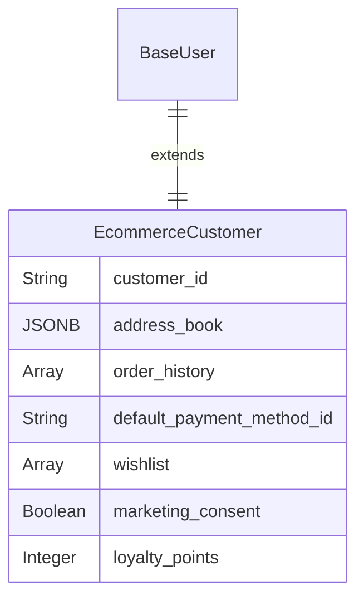
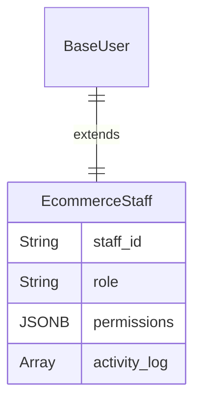
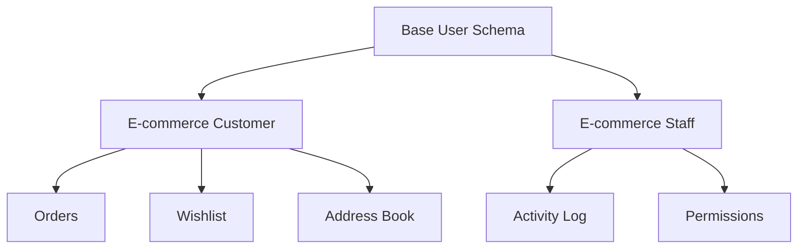

# E-commerce User Schemas

In e-commerce, users are primarily customers, but also include vendors and administrators who manage the platform.

## E-commerce Customer

The schema is optimized for the shopping journey, order fulfillment, and marketing.

| Field Name | Data Type | Description |
|------------|-----------|-------------|
| ... (Base Schema) | - | All foundational user fields. |
| `customer_id` | String | A public-facing unique ID for the customer (e.g., CUST-12345). |
| `address_book` | JSONB / Array | A list of saved shipping and billing addresses. |
| `order_history` | Array (Relation) | A link to all orders placed by this customer. |
| `default_payment_method_id` | String | A tokenized reference to their primary payment option. |
| `wishlist` | Array (Relation) | A list of product_ids the user has saved. |
| `marketing_consent` | Boolean | true if the user has opted-in to receive promotional emails/SMS. |
| `loyalty_points` | Integer | Number of points accumulated in a loyalty program. |

## E-commerce Admin/Staff

The schema is focused on permissions, accountability, and operational roles.

| Field Name | Data Type | Description |
|------------|-----------|-------------|
| ... (Base Schema) | - | All foundational user fields. |
| `staff_id` | String | A unique identifier for the employee (e.g., EMP-101). |
| `role` | String (Enum) | Defines access level: super_admin, product_manager, order_processor, customer_support. |
| `permissions` | JSONB / Array | Granular permissions overriding the role (e.g., can_issue_refund). |
| `activity_log` | Array (Relation) | A link to a log of all actions performed by this admin in the system. |

## E-commerce Schema Relationships

## Implementation Notes

- **Customer ID Format**: Use a consistent format like `CUST-{timestamp}-{random}` for public-facing IDs
- **Address Book**: Store as JSONB for flexibility: `[{"type": "shipping", "address": {...}, "is_default": true}]`
- **Payment Methods**: Never store actual payment data, only tokenized references
- **Marketing Consent**: Track consent history for GDPR compliance
- **Loyalty Points**: Consider using a separate service for point calculations and redemption 