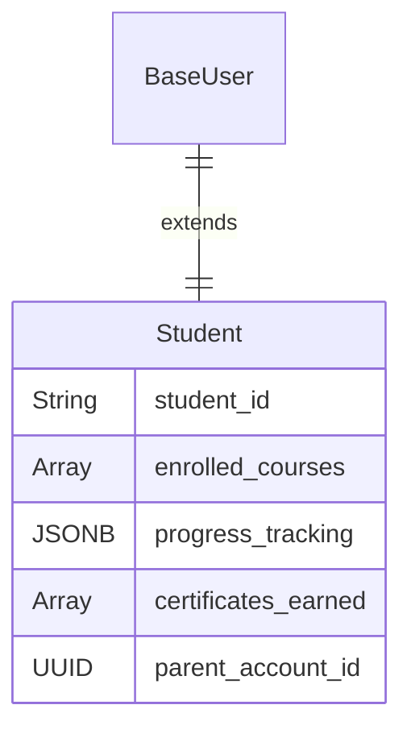
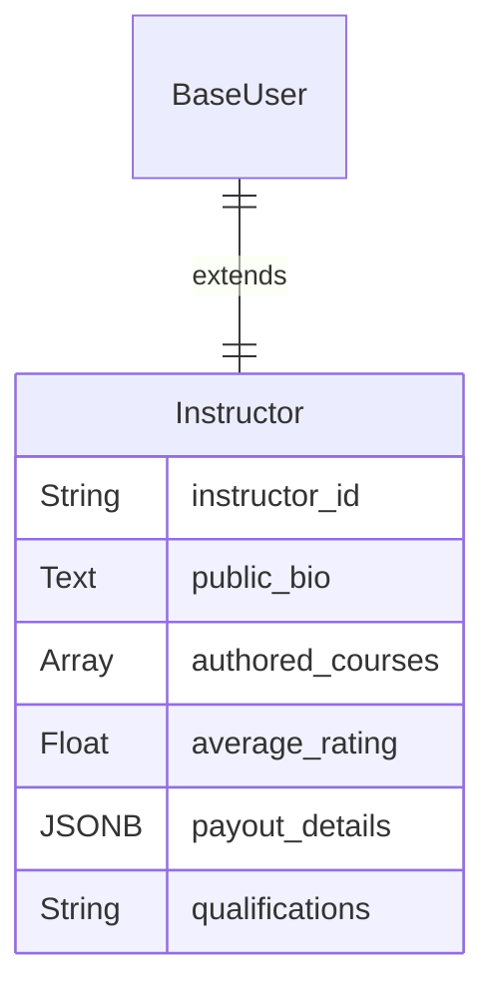
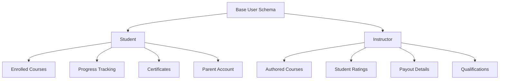

# Education/LMS User Schemas

In an LMS, user roles are distinct and centered around the creation and consumption of educational content.

## Student / Learner

The schema tracks academic progress, engagement, and achievements.

| Field Name | Data Type | Description |
|------------|-----------|-------------|
| ... (Base Schema) | - | All foundational user fields. |
| `student_id` | String | A public-facing unique ID (e.g., for transcripts). |
| `enrolled_courses` | Array (Relation) | A list of course_ids the student is currently enrolled in. |
| `progress_tracking` | JSONB | Tracks completion status. E.g., {"course_123": {"completion": "80%"}}. |
| `certificates_earned` | Array (Relation) | A list of links to certificates the student has been awarded. |
| `parent_account_id` | UUID (Relation) | For K-12 systems, links to a parent's or guardian's account. |

## Instructor / Teacher

The schema focuses on content management, student interaction, and credentials.

| Field Name | Data Type | Description |
|------------|-----------|-------------|
| ... (Base Schema) | - | All foundational user fields. |
| `instructor_id` | String | A unique identifier for the instructor. |
| `public_bio` | Text | A detailed biography displayed on course pages. |
| `authored_courses` | Array (Relation) | A list of course_ids this instructor has created or teaches. |
| `average_rating` | Float | An aggregate rating compiled from student feedback. |
| `payout_details` | JSONB | Securely stores information for revenue sharing or salary payments. |
| `qualifications` | String / Array | A summary of academic or professional qualifications. |

## Education Schema Relationships

## Learning Analytics

### Student Progress Tracking
- **Course Completion**: Track modules, lessons, and assessments completed
- **Time Spent**: Monitor engagement through time tracking
- **Assessment Scores**: Store quiz and exam results
- **Learning Path**: Track personalized learning recommendations

### Instructor Analytics
- **Course Performance**: Student completion rates and satisfaction scores
- **Revenue Tracking**: Earnings from course sales and subscriptions
- **Student Feedback**: Aggregate ratings and reviews
- **Content Engagement**: Which materials are most effective

## Implementation Notes

- **Student ID Format**: Use format like `STU-{year}-{sequence}` for public-facing IDs
- **Progress Tracking**: Store as JSONB: `{"course_123": {"completion": 80, "last_accessed": "2024-01-15", "modules_completed": [1,2,3]}}`
- **Parent Account**: For K-12, implement parent portal with limited access to student progress
- **Certificate Storage**: Store certificate metadata, generate PDFs on-demand
- **Payout Details**: Store securely as JSONB: `{"bank_account": "****1234", "tax_info": {...}}`
- **Course Enrollment**: Use many-to-many relationship table for course enrollments
- **Rating System**: Implement weighted average with recency bias 