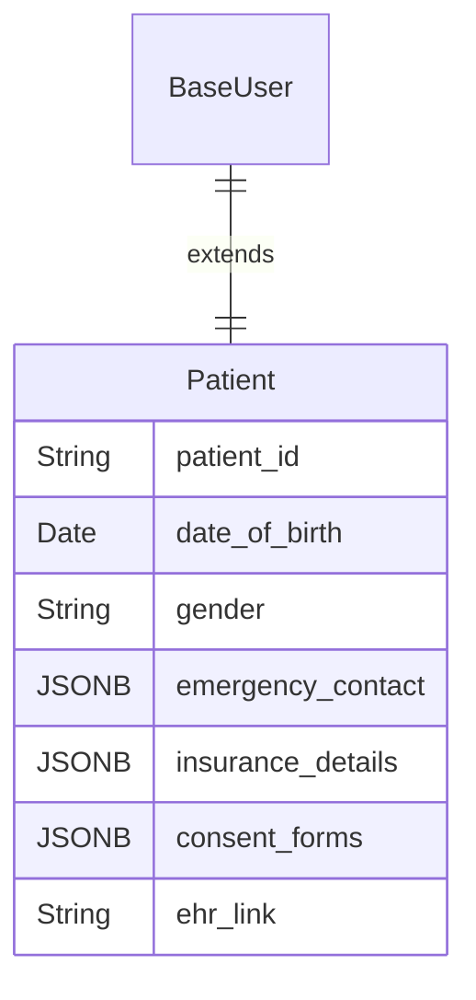
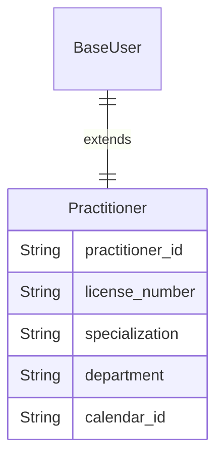
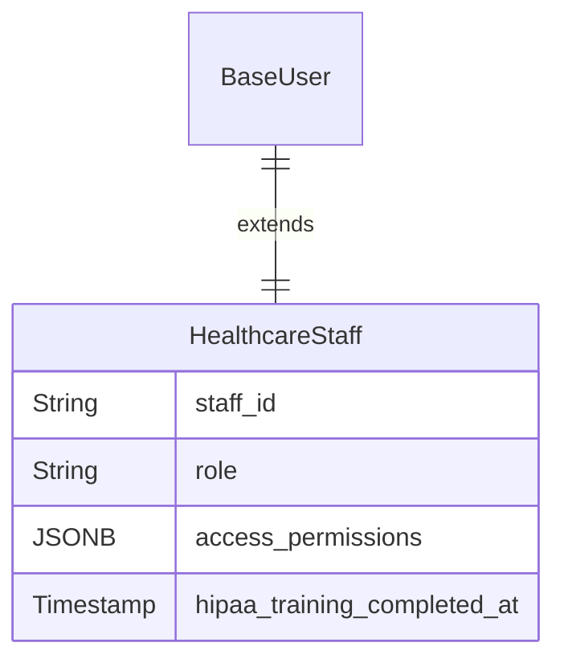
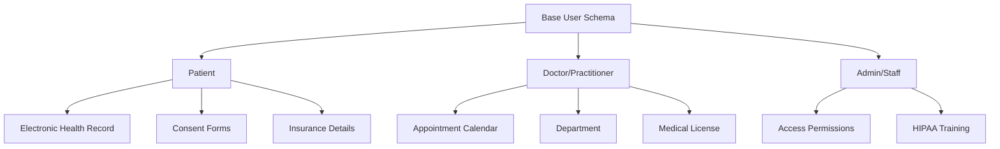

# Healthcare User Schemas

User schemas here are governed by strict privacy regulations like HIPAA. The key is separating personal identity from sensitive medical data.

## Patient

The focus is on identification for clinical purposes and managing consent.

| Field Name | Data Type | Description |
|------------|-----------|-------------|
| ... (Base Schema) | - | All foundational user fields. |
| `patient_id` | String | A unique Medical Record Number (MRN), separate from the user_id. |
| `date_of_birth` | Date | Essential for patient identification and clinical safety. |
| `gender` | String (Enum) | male, female, other, prefer_not_to_say. |
| `emergency_contact` | JSONB | Name, relationship, and phone number of an emergency contact. |
| `insurance_details` | JSONB | Provider, policy number, group number, etc. |
| `consent_forms` | JSONB | Records of signed consents for treatment and data sharing, with timestamps. |
| `ehr_link` | String (Relation) | A secure link to the patient's Electronic Health Record (often in a separate database). |

## Doctor / Practitioner

This schema is built around credentials, specialization, and scheduling.

| Field Name | Data Type | Description |
|------------|-----------|-------------|
| ... (Base Schema) | - | All foundational user fields. |
| `practitioner_id` | String | Unique ID for the healthcare provider. |
| `license_number` | String | Medical license number for verification. |
| `specialization` | String | E.g., Cardiology, Pediatrics, General Practice. |
| `department` | String (Relation) | The hospital department they belong to. |
| `calendar_id` | String | Link to their appointment and availability calendar. |

## Healthcare Admin/Staff

This schema manages non-clinical staff with access to patient or administrative systems.

| Field Name | Data Type | Description |
|------------|-----------|-------------|
| ... (Base Schema) | - | All foundational user fields. |
| `staff_id` | String | Unique ID for the non-clinical staff member. |
| `role` | String (Enum) | receptionist, biller, it_support, department_manager. |
| `access_permissions` | JSONB | Granular permissions for accessing patient data, billing systems, etc. |
| `hipaa_training_completed_at` | Timestamp | Date of completion for mandatory privacy training. |

## Healthcare Schema Relationships

## HIPAA Compliance Requirements

### Privacy Rule
- **Minimum Necessary**: Only access patient data needed for specific tasks
- **Patient Rights**: Right to access, amend, and restrict use of their PHI
- **Notice of Privacy Practices**: Clear communication of how patient data is used

### Security Rule
- **Access Controls**: Unique user identification and automatic logoff
- **Audit Controls**: Record and examine activity in systems containing PHI
- **Integrity**: Ensure PHI is not altered or destroyed in an unauthorized manner

### Breach Notification
- **Timeline**: Notify within 60 days of discovering a breach
- **Content**: Description of what happened, what data was involved, what's being done
- **Media Notice**: For breaches affecting 500+ individuals

## Implementation Notes

- **Patient ID Format**: Use standardized MRN format (e.g., `MRN-YYYY-XXXXX`)
- **EHR Integration**: Implement secure API for EHR system communication
- **Consent Management**: Store consent history with timestamps and digital signatures
- **Emergency Contact**: Store as JSONB: `{"name": "John Doe", "relationship": "spouse", "phone": "+1234567890"}`
- **Insurance Details**: Store as JSONB: `{"provider": "Blue Cross", "policy_number": "123456", "group_number": "789"}`
- **Access Permissions**: Implement role-based access control (RBAC) with granular permissions
- **Audit Logging**: Log all access to patient data with user ID, timestamp, and purpose 