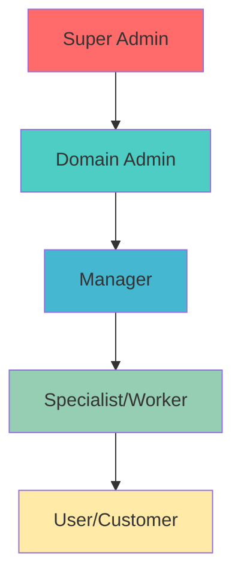
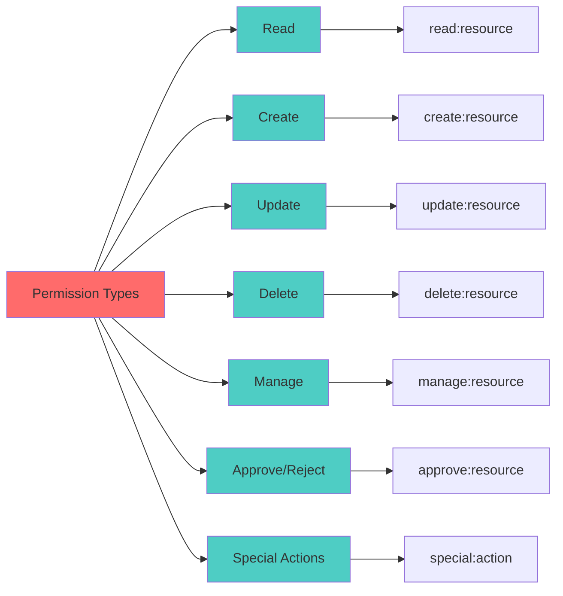
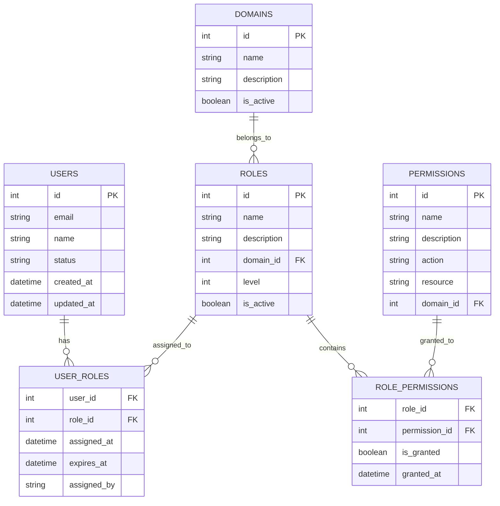
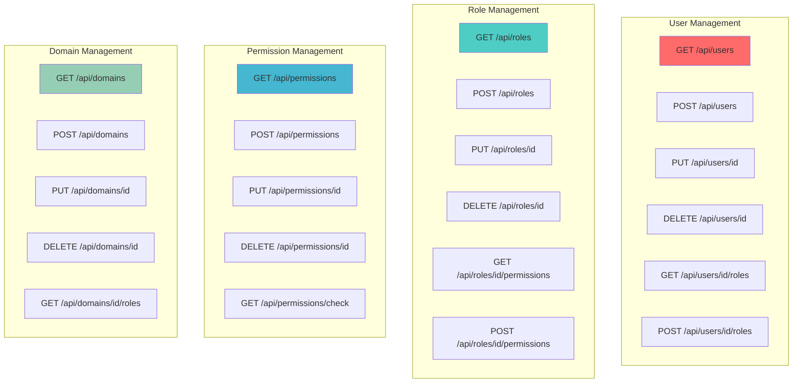

# Role-Permission Mapping Across Industries

This document outlines a Role-Based Access Control (RBAC) model for the user schemas previously defined. It maps each distinct user role to a specific set of permissions, ensuring a secure and efficient operational workflow. Permissions are described using a action:resource convention.

## 1. E-commerce

| Role                 | Core Responsibilities                                 | Permissions                                                                                                                    |
| ---------------------- | ------------------------------------------------------- | -------------------------------------------------------------------------------------------------------------------------------- |
| **Customer**         | Shopping, managing personal account and orders.       | `read:product`, `create:order`, `read:own_order`, `update:own_profile`, `create:review`                                        |
| **Product Manager**  | Manage the product catalog, pricing, and inventory.   | `create:product`, `update:product`, `delete:product`, `read:inventory`, `update:inventory`, `read:category`, `create:category` |
| **Order Processor**  | Fulfill customer orders, manage shipping and returns. | `read:order`, `update:order_status`, `create:shipment`, `read:customer_profile`, `create:refund`                               |
| **Customer Support** | Assist customers with orders, accounts, and issues.   | `read:customer_profile`, `update:customer_profile`, `read:order`, `create:support_ticket`, `read:support_ticket`               |
| **Super Admin**      | Full control over the entire e-commerce platform.     | `manage:users`, `manage:products`, `manage:orders`, `read:reports`, `manage:settings`                                          |

## 2. Fintech / Banking

| Role                   | Core Responsibilities                                              | Permissions                                                                                                        |
| ------------------------ | -------------------------------------------------------------------- | -------------------------------------------------------------------------------------------------------------------- |
| **Customer/Client**    | Manage personal finances, view transactions, make payments.        | `read:own_account`, `create:transaction`, `read:own_transaction_history`, `update:own_profile`, `read:loan_status` |
| **Teller**             | Process basic customer transactions like deposits and withdrawals. | `read:customer_account`, `create:deposit`, `create:withdrawal`, `verify:customer_identity`                         |
| **Loan Officer**       | Evaluate and process loan applications.                            | `read:loan_application`, `update:loan_application`, `approve:loan`, `reject:loan`, `read:credit_history`           |
| **Compliance Officer** | Monitor transactions for fraud and ensure regulatory adherence.    | `read:all_transactions`, `flag:suspicious_activity`, `generate:regulatory_report`, `read:kyc_data`                 |
| **Fraud Analyst**      | Investigate flagged transactions and security alerts.              | `read:transaction_details`, `read:user_login_history`, `lock:account`, `unlock:account`                            |

## 3. Healthcare

| Role                    | Core Responsibilities                                     | Permissions                                                                                                                       |
| ------------------------- | ----------------------------------------------------------- | ----------------------------------------------------------------------------------------------------------------------------------- |
| **Patient**             | Access personal health records, book appointments.        | `read:own_medical_record`, `create:appointment`, `read:own_appointment`, `update:own_profile`, `message:practitioner`             |
| **Doctor/Practitioner** | Diagnose and treat patients, manage medical records.      | `read:patient_medical_record`, `update:patient_medical_record`, `create:prescription`, `read:lab_result`, `manage:own_schedule`   |
| **Receptionist**        | Manage patient check-in, appointments, and basic records. | `create:patient_profile`, `update:patient_demographics`, `read:appointment_schedule`, `create:appointment`, `manage:billing_info` |
| **Biller**              | Handle insurance claims and patient billing.              | `create:invoice`, `read:billing_history`, `submit:insurance_claim`, `update:payment_status`                                       |
| **IT/System Admin**     | Manage the technical infrastructure, not patient data.    | `manage:user_accounts`, `read:system_logs`, `manage:application_settings`, `perform:backup`                                       |

## 4. Education (LMS)

| Role                   | Core Responsibilities                                | Permissions                                                                                                |
| ------------------------ | ------------------------------------------------------ | ------------------------------------------------------------------------------------------------------------ |
| **Student/Learner**    | Take courses, submit assignments, track progress.    | `enroll:course`, `read:course_content`, `submit:assignment`, `read:own_grades`, `participate:forum`        |
| **Instructor/Teacher** | Create courses, grade assignments, manage students.  | `create:course`, `update:course_content`, `create:assignment`, `grade:submission`, `read:student_progress` |
| **Parent/Guardian**    | Monitor a student's progress and attendance.         | `read:child_grades`, `read:child_progress`, `read:announcements`, `message:instructor`                     |
| **Administrator**      | Manage the overall LMS platform, users, and courses. | `manage:users`, `manage:courses`, `read:all_reports`, `manage:lms_settings`, `manage:enrollments`          |

## 5. SaaS (Software as a Service)

| Role              | Core Responsibilities                                            | Permissions                                                                                                         |
| ------------------- | ------------------------------------------------------------------ | --------------------------------------------------------------------------------------------------------------------- |
| **User (Viewer)** | View data and resources within a team account.                   | `read:project`, `read:document`, `read:dashboard`, `create:comment`                                                 |
| **User (Editor)** | Create and modify resources within a team account.               | `create:project`, `update:project`, `delete:project`, `invite:viewer`                                               |
| **Tenant Admin**  | Manage users, billing, and settings for their company's account. | `manage:tenant_users`, `update:billing_details`, `read:usage_reports`, `manage:tenant_settings`                     |
| **Super Admin**   | Manage the entire SaaS platform and all customer tenants.        | `manage:tenants`, `manage:subscriptions`, `read:platform_analytics`, `impersonate:user`, `manage:platform_settings` |

## 6. Social Media & Community

| Role          | Core Responsibilities                                      | Permissions                                                                                                |
| --------------- | ------------------------------------------------------------ | ------------------------------------------------------------------------------------------------------------ |
| **User**      | Post content, interact with others, manage their profile.  | `create:post`, `update:own_post`, `delete:own_post`, `create:comment`, `follow:user`, `update:own_profile` |
| **Moderator** | Enforce community guidelines by reviewing flagged content. | `read:flagged_content`, `delete:any_post`, `delete:any_comment`, `warn:user`, `suspend:user`               |
| **Admin**     | Manage community settings, moderators, and policies.       | `manage:moderators`, `manage:community_settings`, `read:analytics`, `ban:user`, `create:announcement`      |

## 7. Hospitality & Hotels

| Role                 | Core Responsibilities                                         | Permissions                                                                                                             |
| ---------------------- | --------------------------------------------------------------- | ------------------------------------------------------------------------------------------------------------------------- |
| **Guest**            | Book rooms, manage reservations, access hotel services.       | `create:reservation`, `read:own_reservation`, `update:own_reservation`, `cancel:own_reservation`, `read:hotel_services` |
| **Front Desk Agent** | Check-in/check-out guests, manage room assignments.           | `read:guest_profile`, `create:check_in`, `create:check_out`, `update:room_assignment`, `process:payment`                |
| **Housekeeping**     | Manage room status, maintenance requests, cleaning schedules. | `update:room_status`, `create:maintenance_request`, `read:cleaning_schedule`, `update:cleaning_status`                  |
| **Manager**          | Oversee operations, manage staff, handle guest complaints.    | `manage:staff_schedule`, `read:occupancy_reports`, `handle:guest_complaint`, `manage:hotel_settings`                    |
| **Super Admin**      | Full control over hotel management system.                    | `manage:hotels`, `manage:users`, `read:all_reports`, `manage:system_settings`                                           |

## 8. Logistics & Supply Chain

| Role                  | Core Responsibilities                                        | Permissions                                                                                     |
| ----------------------- | -------------------------------------------------------------- | ------------------------------------------------------------------------------------------------- |
| **Driver**            | Deliver packages, update delivery status, manage routes.     | `read:delivery_route`, `update:delivery_status`, `read:package_details`, `create:delivery_note` |
| **Warehouse Worker**  | Process inventory, pack orders, manage stock levels.         | `read:inventory`, `update:stock_level`, `create:packing_list`, `scan:barcode`                   |
| **Dispatcher**        | Assign deliveries, manage driver schedules, track shipments. | `assign:delivery`, `manage:driver_schedule`, `track:shipment`, `create:route`                   |
| **Logistics Manager** | Optimize routes, manage fleet, analyze performance.          | `optimize:routes`, `manage:fleet`, `read:performance_analytics`, `manage:logistics_settings`    |
| **Super Admin**       | Full control over logistics platform.                        | `manage:logistics_system`, `manage:users`, `read:all_reports`, `manage:platform_settings`       |

## 9. Media & Streaming

| Role                  | Core Responsibilities                                  | Permissions                                                                                              |
| ----------------------- | -------------------------------------------------------- | ---------------------------------------------------------------------------------------------------------- |
| **Viewer**            | Watch content, create playlists, manage preferences.   | `read:content`, `create:playlist`, `update:own_playlist`, `rate:content`, `update:preferences`           |
| **Content Creator**   | Upload content, manage uploads, view analytics.        | `upload:content`, `update:own_content`, `delete:own_content`, `read:own_analytics`, `manage:own_channel` |
| **Content Moderator** | Review uploaded content, enforce guidelines.           | `review:content`, `approve:content`, `reject:content`, `flag:inappropriate_content`, `warn:creator`      |
| **Platform Admin**    | Manage platform settings, users, and content policies. | `manage:platform_settings`, `manage:users`, `manage:content_policies`, `read:platform_analytics`         |
| **Super Admin**       | Full control over media platform.                      | `manage:media_platform`, `manage:all_users`, `read:all_analytics`, `manage:system_settings`              |

## 10. Manufacturing

| Role                       | Core Responsibilities                                           | Permissions                                                                                                     |
| ---------------------------- | ----------------------------------------------------------------- | ----------------------------------------------------------------------------------------------------------------- |
| **Production Worker**      | Operate machinery, record production data, report issues.       | `read:production_schedule`, `update:production_status`, `create:quality_report`, `report:issue`                 |
| **Quality Inspector**      | Inspect products, approve/reject batches, maintain standards.   | `read:quality_standards`, `approve:batch`, `reject:batch`, `create:inspection_report`, `update:quality_metrics` |
| **Production Manager**     | Oversee production lines, manage schedules, optimize processes. | `manage:production_schedule`, `read:production_analytics`, `optimize:process`, `manage:production_staff`        |
| **Maintenance Technician** | Perform equipment maintenance, schedule repairs, track assets.  | `read:maintenance_schedule`, `update:equipment_status`, `create:maintenance_report`, `schedule:repair`          |
| **Super Admin**            | Full control over manufacturing system.                         | `manage:manufacturing_system`, `manage:users`, `read:all_reports`, `manage:system_settings`                     |

## 11. Real Estate

| Role                  | Core Responsibilities                                           | Permissions                                                                                                           |
| ----------------------- | ----------------------------------------------------------------- | ----------------------------------------------------------------------------------------------------------------------- |
| **Buyer/Seller**      | View properties, schedule viewings, manage transactions.        | `read:property_listing`, `schedule:viewing`, `read:own_transaction`, `update:own_profile`, `contact:agent`            |
| **Real Estate Agent** | Manage listings, show properties, handle client communications. | `create:property_listing`, `update:property_listing`, `manage:client_profile`, `schedule:viewing`, `read:market_data` |
| **Property Manager**  | Manage rental properties, handle maintenance, collect rent.     | `manage:rental_properties`, `create:maintenance_request`, `process:rent_payment`, `read:tenant_profile`               |
| **Broker**            | Oversee agents, manage transactions, analyze market data.       | `manage:agents`, `oversee:transactions`, `read:market_analytics`, `approve:deals`, `manage:brokerage_settings`        |
| **Super Admin**       | Full control over real estate platform.                         | `manage:real_estate_platform`, `manage:users`, `read:all_reports`, `manage:platform_settings`                         |

## 12. HR & Recruitment

| Role              | Core Responsibilities                                           | Permissions                                                                                                              |
| ------------------- | ----------------------------------------------------------------- | -------------------------------------------------------------------------------------------------------------------------- |
| **Employee**      | View own profile, submit time-off requests, access benefits.    | `read:own_profile`, `update:own_profile`, `submit:time_off_request`, `read:own_payroll`, `access:benefits`               |
| **HR Specialist** | Manage employee records, process requests, handle onboarding.   | `read:employee_profile`, `update:employee_profile`, `process:hr_request`, `manage:onboarding`, `read:hr_reports`         |
| **Recruiter**     | Post jobs, review applications, manage candidates.              | `create:job_posting`, `read:application`, `update:application_status`, `schedule:interview`, `manage:candidate_pipeline` |
| **HR Manager**    | Oversee HR operations, manage policies, analyze workforce data. | `manage:hr_policies`, `read:workforce_analytics`, `approve:hr_requests`, `manage:hr_staff`, `read:compliance_reports`    |
| **Super Admin**   | Full control over HR platform.                                  | `manage:hr_platform`, `manage:users`, `read:all_reports`, `manage:system_settings`                                       |

## Permission Inheritance and Hierarchy

## Permission Categories

## Implementation Guidelines

### 1. Permission Format

- Use `action:resource` convention (e.g., `read:product`, `create:order`)
- Prefix with `own_` for user-specific resources (e.g., `read:own_order`)
- Use `manage:` for administrative actions (e.g., `manage:users`)

### 2. Role Assignment

- Users can have multiple roles across different domains
- Roles are domain-specific with clear boundaries
- Inheritance follows the hierarchy: Super Admin → Domain Admin → Manager → Specialist → User

### 3. Security Best Practices

- Principle of least privilege - users get minimum required permissions
- Regular permission audits and reviews
- Automatic role expiration for temporary access
- Comprehensive audit logging for all permission changes

### 4. Multi-Tenant Considerations

- Tenant isolation ensures data separation
- Cross-tenant access requires explicit permission
- Tenant-specific role definitions and customizations
- Resource quota management per tenant

## Database Schema

## API Endpoints

## Conclusion

This RBAC schema provides a comprehensive and scalable foundation for managing user access across all business domains in the Filament Suite platform. The role-permission mapping ensures:

- **Security**: Clear permission boundaries and least privilege principle
- **Scalability**: Domain-specific roles that can be extended and customized
- **Maintainability**: Consistent permission format and clear documentation
- **Compliance**: Built-in support for audit trails and regulatory requirements
- **Flexibility**: Support for multi-tenant environments and cross-domain access

### Next Steps:

1. Implement the database schema with proper relationships
2. Create API endpoints for role and permission management
3. Develop authentication and authorization middleware
4. Build admin interface for RBAC management
5. Implement comprehensive audit logging
6. Create automated testing for permission scenarios

