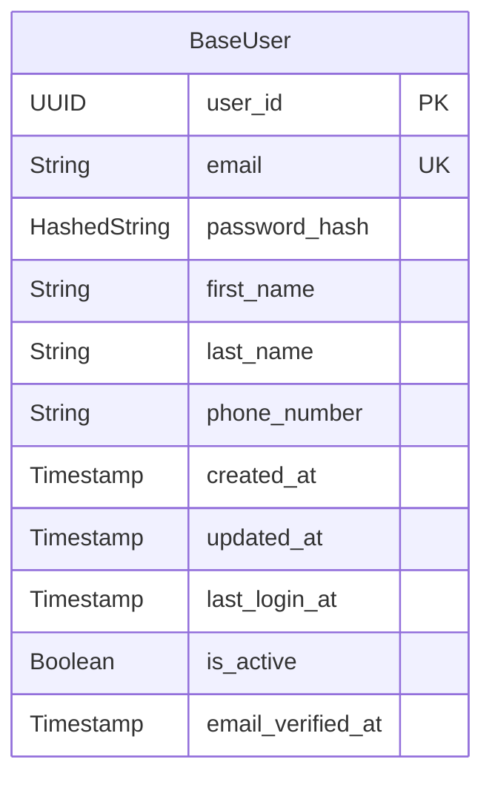

# Consolidated User Schemas Across Industries

The concept of a "user" is fundamental to nearly every software application, but its structure and the data it holds can vary dramatically depending on the industry and the user's role. A well-designed user schema is crucial for business operations, regulatory compliance, and providing a tailored user experience.

This document provides a consolidated view of user schemas, starting with a universal base and then detailing the specific extensions for different sectors.

## 1. Base User Schema: The Foundation

Almost all user schemas are built upon this common foundation, which handles universal needs like identity, authentication, and basic contact information.

| Field Name | Data Type | Description |
|------------|-----------|-------------|
| `user_id` | UUID / BigInt | A unique identifier for the user in the database. Primary Key. |
| `email` | String | The user's email address, used for login and communication. Must be unique. |
| `password_hash` | HashedString | The user's password after being salted and hashed. Never store plain text. |
| `first_name` | String | User's first name. |
| `last_name` | String | User's last name. |
| `phone_number` | String | User's contact phone number, often used for 2FA. |
| `created_at` | Timestamp | The date and time the user account was created. |
| `updated_at` | Timestamp | The date and time the user account was last updated. |
| `last_login_at` | Timestamp | The timestamp of the user's last successful login. |
| `is_active` | Boolean | A flag to activate or deactivate the account without deleting it. |
| `email_verified_at` | Timestamp | Timestamp for when the user verified their email address. |

## Industry-Specific Schemas

The following industry-specific user schemas extend the base user schema with domain-specific fields and relationships:

- **[E-commerce User Schemas](ecommerce-user-schemas.md)** - Customer and staff schemas for online retail
- **[Fintech/Banking User Schemas](fintech-banking-user-schemas.md)** - Customer and staff schemas with KYC/AML compliance
- **[Healthcare User Schemas](healthcare-user-schemas.md)** - Patient, practitioner, and staff schemas with HIPAA compliance
- **[Education/LMS User Schemas](education-lms-user-schemas.md)** - Student and instructor schemas for learning platforms
- **[Hospitality User Schemas](hospitality-user-schemas.md)** - Hotel guest and restaurant customer schemas
- **[Content & Media User Schemas](content-media-user-schemas.md)** - Subscriber and author schemas for content platforms
- **[SaaS User Schemas](saas-user-schemas.md)** - Multi-tenant user schemas for B2B software
- **[Social Media User Schemas](social-media-user-schemas.md)** - Community user schemas for social platforms

## Schema Relationships Overview

```mermaid
graph TB
    BaseUser[Base User Schema]
    
    BaseUser --> Ecommerce[E-commerce]
    BaseUser --> Banking[Fintech/Banking]
    BaseUser --> Healthcare[Healthcare]
    BaseUser --> Education[Education/LMS]
    BaseUser --> Hospitality[Hospitality]
    BaseUser --> Media[Content & Media]
    BaseUser --> SaaS[SaaS]
    BaseUser --> Social[Social Media]
    
    Ecommerce --> EcommerceCustomer[Customer]
    Ecommerce --> EcommerceStaff[Staff]
    
    Banking --> BankingCustomer[Customer]
    Banking --> BankingStaff[Staff]
    
    Healthcare --> Patient[Patient]
    Healthcare --> Practitioner[Doctor/Practitioner]
    Healthcare --> HealthcareStaff[Admin/Staff]
    
    Education --> Student[Student]
    Education --> Instructor[Instructor]
    
    Hospitality --> HotelGuest[Hotel Guest]
    Hospitality --> RestaurantCustomer[Restaurant Customer]
    
    Media --> Subscriber[Subscriber]
    Media --> Author[Author/Editor]
    
    SaaS --> SaaSUser[Tenant User]
    SaaS --> SAASSuperAdmin[Super Admin]
    
    Social --> CommunityUser[Community User]
```

## Key Design Principles

1. **Inheritance**: All industry-specific schemas extend the base user schema
2. **Security**: Sensitive data (IDs, passwords) are always hashed
3. **Compliance**: Industry-specific fields address regulatory requirements
4. **Scalability**: JSONB fields allow flexible data storage
5. **Audit Trails**: Critical operations maintain immutable logs
6. **Privacy**: Personal and sensitive data are properly separated

## Implementation Considerations

- **Database Choice**: Consider PostgreSQL for JSONB support and complex queries
- **Indexing**: Create indexes on frequently queried fields (email, user_id, etc.)
- **Partitioning**: For large-scale applications, consider partitioning by tenant or date
- **Caching**: Cache user profiles and permissions for performance
- **API Design**: Design RESTful APIs that respect the schema hierarchy

