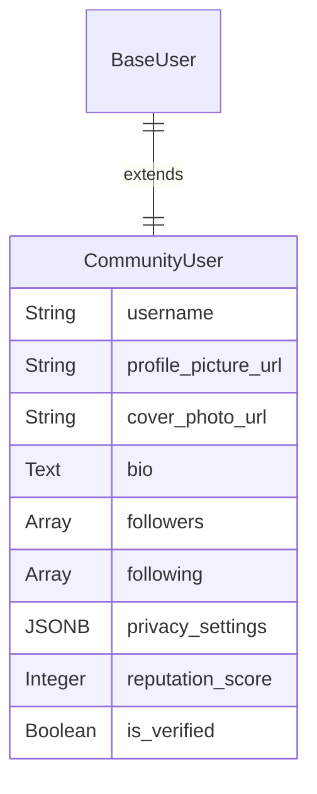
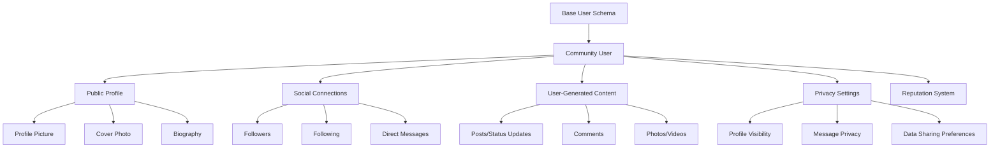

# Social Media User Schemas

This schema is designed around user identity, connections, and content sharing.

## Community User

The schema focuses on the public profile, social connections, and user-generated content.

| Field Name | Data Type | Description |
|------------|-----------|-------------|
| ... (Base Schema) | - | All foundational user fields. |
| `username` | String | A unique, public-facing handle (e.g., @username). Must be unique. |
| `profile_picture_url` | String | URL for the user's avatar. |
| `cover_photo_url` | String | URL for the user's profile banner image. |
| `bio` | Text | A short, user-written public biography. |
| `followers` | Array (Relation) | A list of user_ids who follow this user. |
| `following` | Array (Relation) | A list of user_ids this user is following. |
| `privacy_settings` | JSONB | User-defined settings, e.g., {"profile": "public", "messages": "friends_only"}. |
| `reputation_score` | Integer | A score based on community interaction (upvotes, badges, etc.). |
| `is_verified` | Boolean | true if the account is a verified personality or brand. |

## Social Media Schema Relationships

## Social Features & Interactions

### User Profile Management
- **Customization**: Profile pictures, cover photos, bios, and themes
- **Verification**: Official verification for public figures and brands
- **Privacy Controls**: Granular settings for profile visibility and interactions
- **Account Types**: Personal, business, creator, and organization accounts

### Social Connections
- **Following System**: One-way connections (Twitter-style) or mutual friends (Facebook-style)
- **Friend Requests**: For mutual connection platforms
- **Blocking**: User blocking and content filtering
- **Muting**: Temporarily hide content without unfollowing

### Content Creation & Engagement
- **Post Types**: Text, images, videos, stories, live streams
- **Engagement Metrics**: Likes, shares, comments, saves
- **Content Moderation**: Automated and manual content filtering
- **Monetization**: Creator tools, tipping, and revenue sharing

## Implementation Notes

- **Username Format**: Enforce unique usernames with validation (alphanumeric, underscores, 3-15 characters)
- **Profile Pictures**: Store URLs to CDN, implement image optimization and cropping
- **Privacy Settings**: Store as JSONB: `{"profile": "public", "messages": "friends_only", "posts": "followers_only"}`
- **Followers/Following**: Use separate junction tables for efficient querying and pagination
- **Reputation Score**: Calculate based on engagement, content quality, and community feedback
- **Verification Process**: Implement application and review workflow for verification badges
- **Content Storage**: Use separate tables for posts, comments, and media with proper indexing
- **Real-time Features**: Implement WebSocket connections for live notifications and messaging
- **Content Moderation**: Use AI-powered content filtering with human review for appeals
- **Analytics**: Track user engagement, content performance, and platform growth metrics 