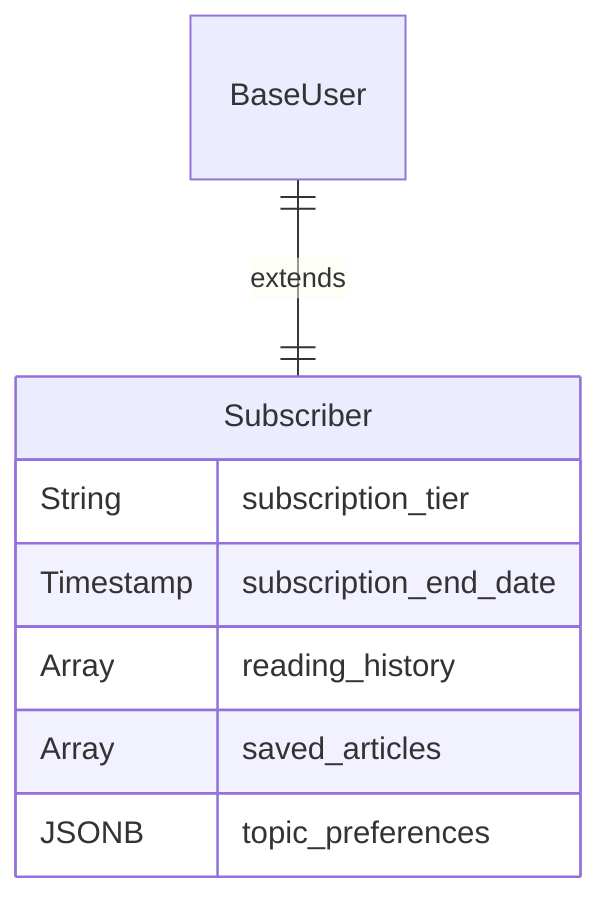
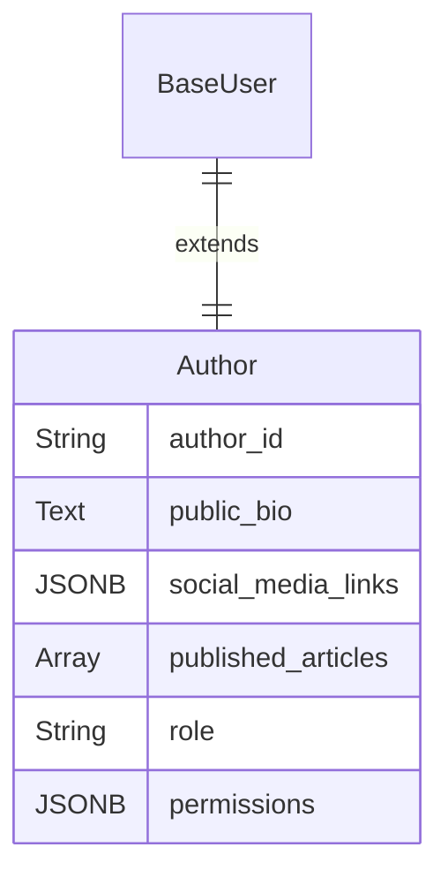
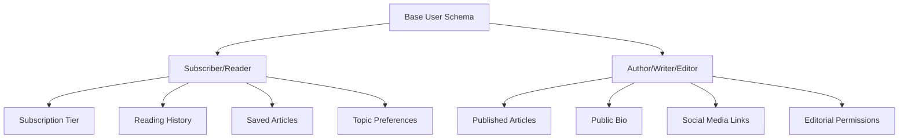

# Content & Media User Schemas

For platforms like blogs or news sites, user schemas are based on content interaction: creation, curation, and consumption.

## Subscriber / Reader

The schema manages access levels and personalizes content discovery.

| Field Name | Data Type | Description |
|------------|-----------|-------------|
| ... (Base Schema) | - | All foundational user fields. |
| `subscription_tier` | String (Enum) | Access level, e.g., free, premium, ad-free. |
| `subscription_end_date` | Timestamp | For paid users, marks when their subscription expires. |
| `reading_history` | Array (Relation) | A list of article_ids the user has viewed. |
| `saved_articles` | Array (Relation) | A "read it later" list of article_ids. |
| `topic_preferences` | JSONB | Topics the user is interested in for personalizing their feed. |

## Author / Writer / Editor

This schema provides the tools for content creators and defines their workflow permissions.

| Field Name | Data Type | Description |
|------------|-----------|-------------|
| ... (Base Schema) | - | All foundational user fields. |
| `author_id` | String | A unique ID for attribution on articles. |
| `public_bio` | Text | The author's biography displayed publicly with their articles. |
| `social_media_links` | JSONB | Links to their Twitter, LinkedIn, or other professional profiles. |
| `published_articles` | Array (Relation) | A list of article_ids for all content they have published. |
| `role` | String (Enum) | Defines editorial authority: author, editor, publisher. |
| `permissions` | JSONB | For editors: granular control like {"can_publish": true}. |

## Content & Media Schema Relationships

## Content Personalization

### Reader Experience
- **Content Discovery**: Algorithm-driven recommendations based on reading history
- **Subscription Management**: Tier upgrades, payment processing, access control
- **Reading Analytics**: Time spent, completion rates, engagement metrics
- **Social Features**: Comments, sharing, following authors

### Author Experience
- **Content Management**: Draft creation, editing, publishing workflow
- **Analytics Dashboard**: Article performance, reader engagement, revenue
- **Collaboration Tools**: Co-authoring, editorial review process
- **Monetization**: Revenue sharing, sponsored content, affiliate links

## Implementation Notes

- **Subscription Tiers**: Implement as enum: `free`, `premium`, `ad_free`, `enterprise`
- **Reading History**: Store as array of article IDs with timestamps
- **Topic Preferences**: Store as JSONB: `{"categories": ["tech", "business"], "excluded": ["politics"]}`
- **Social Media Links**: Store as JSONB: `{"twitter": "@username", "linkedin": "profile_url"}`
- **Permissions**: Store as JSONB: `{"can_publish": true, "can_edit_others": false, "can_moderate": true}`
- **Author ID Format**: Use format like `AUTH-{year}-{sequence}` for public attribution
- **Content Analytics**: Track views, time spent, scroll depth, and engagement metrics
- **Subscription Billing**: Integrate with payment processors for recurring billing 