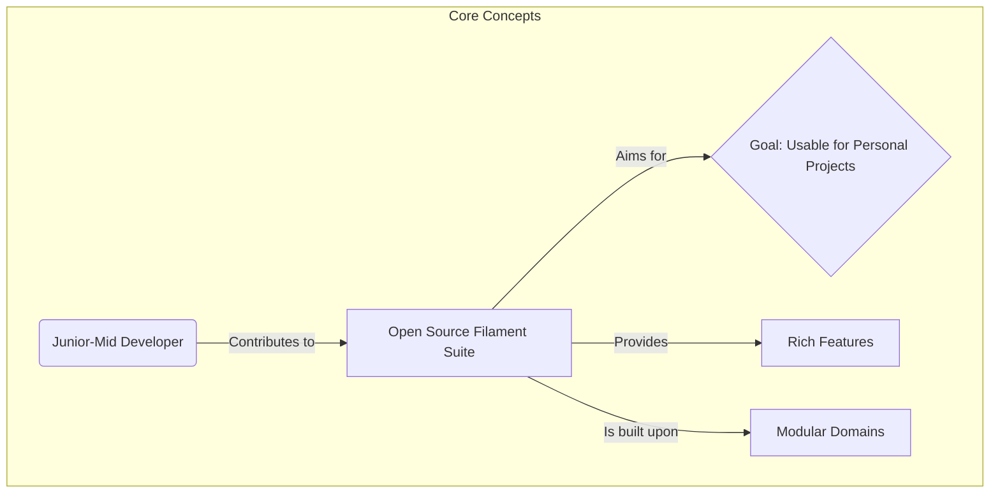
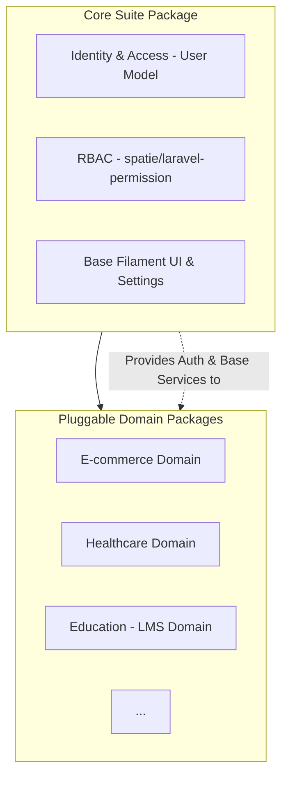
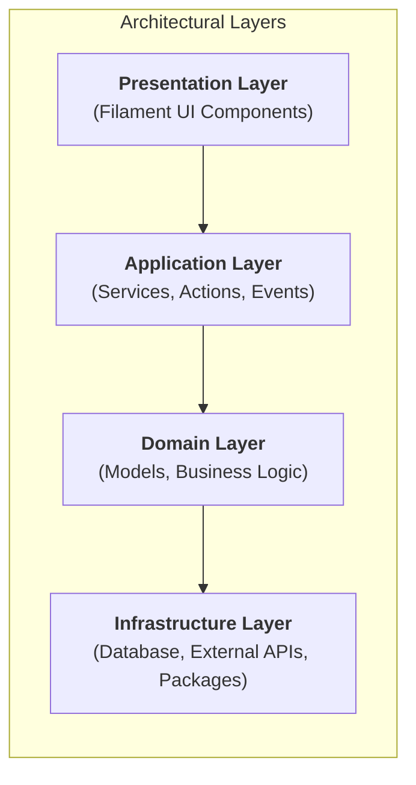
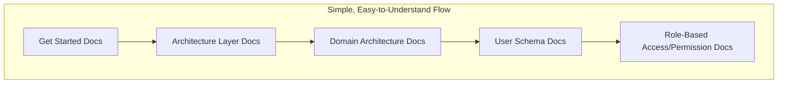
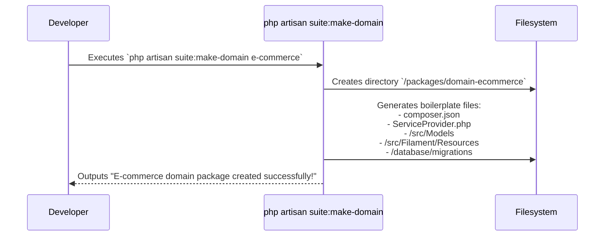

# Filament Suite: High-Level Project Documentation

## 1. Introduction: The Vision

Welcome to Filament Suite, an open-source project with a clear and ambitious vision: to create a powerful, modular "super admin" application built on FilamentPHP.

The diagram below outlines the core concept of the project:

Our primary goal is to build a foundational application that is both rich in built-in features and easily extensible with custom, domain-specific functionality. We aim to create a tool that is immediately useful for a developer's own projects while also providing a clear and accessible path for them to contribute back to the community.

This is achieved by focusing on two key areas: **Modular Domains** and **Simple, Easy-to-Understand Documentation**.

## 2. The Core Architecture: A Modular Monolith

To achieve our vision of "pluggable domains," we are adopting a Modular Monolith architecture based on Domain-Driven Design (DDD) principles. This gives us the organizational benefits of separating business logic without the operational complexity of managing multiple microservices.

- **Bounded Contexts as Packages**: Each business domain (e.g., E-commerce, Healthcare) is a self-contained, installable Laravel Package.
- **The Core Suite Package**: This is the heart of the application. It provides the foundational services that all other domain packages rely on.
- **The Domain Packages**: These are the optional, pluggable modules that provide domain-specific functionality.

This structure allows a developer to start with a lean core and install only the domains they need.

## 3. Architectural Layers

To ensure a clean separation of concerns and promote maintainability, `filament-suite` follows a layered architecture. Each layer has a distinct responsibility, and dependencies flow in a single direction from top to bottom.

### 3.1. Presentation Layer (UI)
This is the top-most layer, responsible for everything the user sees and interacts with.
- **Components**: Filament Resources, Pages, Widgets, Forms, and Tables.
- **Responsibility**: Displaying data, capturing user input, and delegating actions to the application layer. It should not contain any business logic.

### 3.2. Application Layer
This layer orchestrates the application's tasks. It acts as a bridge between the Presentation Layer and the Domain Layer.
- **Components**: Application Services, Filament Actions' logic, Laravel Jobs, Events, and Listeners.
- **Responsibility**: To execute specific use cases. For example, a `CreateUser` service would contain the logic to validate input, call the domain layer to create a user, and dispatch an event.

### 3.3. Domain Layer (Business Logic)
This is the heart of the application, where the core business logic resides. It is completely independent of the UI and the application framework.
- **Components**: Eloquent Models (with business rules), Domain Services, Enums, and Value Objects.
- **Responsibility**: To represent the business domain, enforce business rules, and manage the state of the application. The `domain-*` packages live primarily in this layer.

### 3.4. Infrastructure Layer
This layer contains all the technical implementation details that support the other layers.
- **Components**: Database migrations, Eloquent model configurations, external API clients (Adapters), and third-party package integrations (like `spatie/laravel-permission`).
- **Responsibility**: To handle persistence, communicate with external systems, and provide other low-level services.

## 4. The Contributor's Journey: A Clear Path to Contribution

We want to make contributing as straightforward as possible for junior-to-mid-level developers. The entire process is designed around a simple, repeatable workflow.

### Step 1: Understand the Architecture

A new contributor's first step is to read our documentation. We provide a simple, easy-to-understand flow that covers all essential architectural layers.

### Step 2: Scaffold a New Domain

Instead of manual setup, contributors use a custom artisan command to generate all the necessary boilerplate for a new domain package.

### Step 3: Build the Features

With the structure in place, the contributor can now focus on what matters: building the Models, Filament Resources, and business logic for their chosen domain. Communication between the new domain and the core application is handled cleanly using Laravel's native event system.

## 5. Project Structure & Key Technologies

| Layer             | Component          | Technology/Tool            | Responsibility                                   |
| ------------------- | -------------------- | ---------------------------- | -------------------------------------------------- |
| **Core**          | core-suite package | Laravel, FilamentPHP       | Identity, Authentication, Base UI                |
| **Authorization** | RBAC Engine        | spatie/laravel-permission  | Manages roles and permissions                    |
| **Domain**        | /packages/domain-* | Laravel Packages           | Self-contained business logic (E-commerce, etc.) |
| **Communication** | Event System       | Laravel Events & Listeners | Decoupled communication between packages         |
| **Workflow**      | Scaffolding        | Custom Artisan Command     | Simplifies new domain creation                   |

By combining a powerful vision with a clear, documented, and accessible architecture, **filament-suite** is poised to become a valuable tool and a thriving open-source community.
